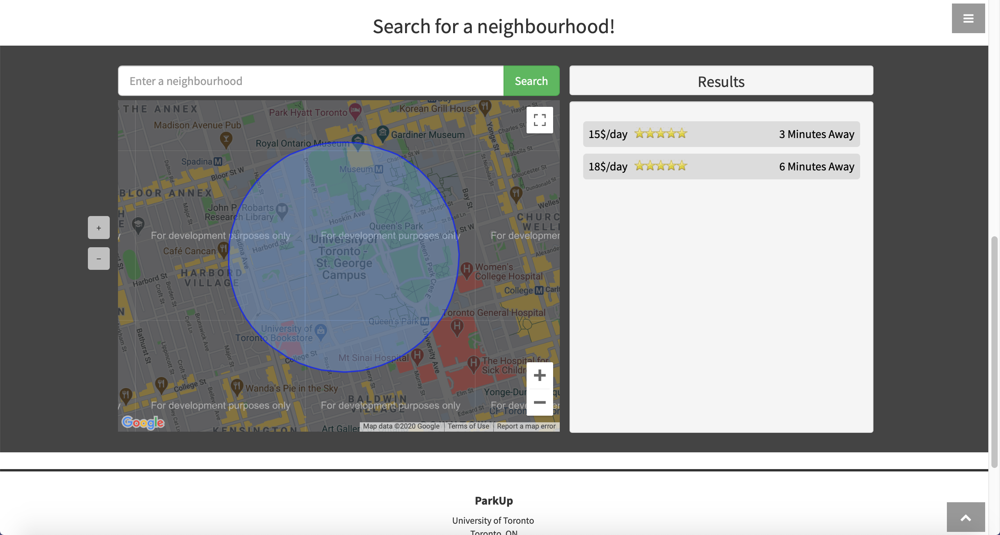
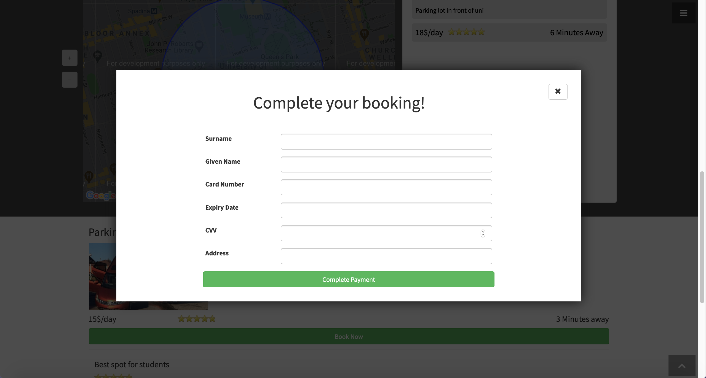
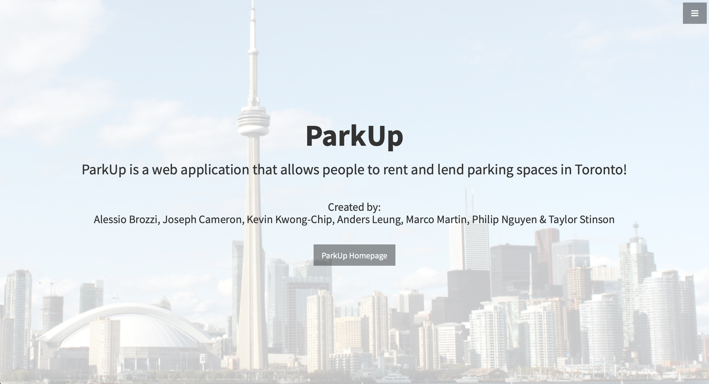
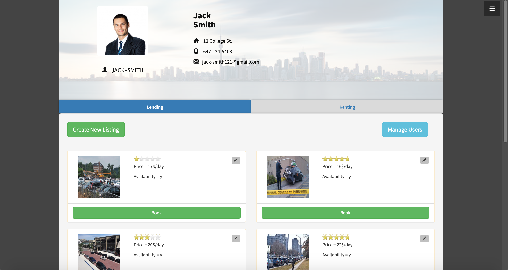

# ParkUp

ParkUp is a Node.js Express web application made as a project for CSC301 Software Engineering at the University of Toronto during the fall 2016 academic semester.
I created ParkUp with a team of 6 other members.
The full team was (in alphabetical order): Alessio Brozzi, Joseph Cameron (me), Kevin Kwong-Chip, Anders Leung, Marco Martin, Philip Nguyen & Taylor Stinson.

ParkUp is a web application that allows people to rent and lend parking spaces in Toronto!
You can search for spaces on a map in a certain area by expanding or shrinking the search circle.
The map, by default, starts at the University of Toronto with a default search circle representing an area within 5 minutes walking distance.
There is also the added functionality of a profile page, creating and ammending new listings, adding and editing reviews, document upload etc.

ParkUp was designed to have a lot of placeholder functionality.
For example, we have the scaffolding and framework in place for many external systems, like an external secure payment system when booking.
ParkUp's main goal is to demonstrate the user experience of such an application where users can rent and lend parking spaces.

Our group produced a short video showing a quick demonstration of ParkUp here: [ParkUp Video](https://youtu.be/829L_W2TnVM).

Furthermore, here are some screenshots of ParkUp in action:

*ParkUp Homepage*


*ParkUp Map Search*


*ParkUp Booking Prompt*


*ParkUp About Page*


*ParkUp Profile Page*


**NOTE**: If you have a valid Google Maps API key from a billing account, replace the default API key in the [parkup/index.html](parkup/index.html) file at line 215 with your own API key.
This is to be in accordance with Google's new Google Maps API platform that was unveiled after the development of this web app, which requires a billing account to generate a fully functional API key.
The app still functions as intended with the default API key provided, adding your own API key will only remove the 'This page can't load Google Maps correctly' and 'For development purposes only' prompts that initially appear.

---

## How to Run

1. Clone/Download this repository.
2. Open Command Line/Terminal.
3. Navigate to the [parkup](parkup) folder.
4. Run the following command to install all the necessary dependencies:
```
$ npm install
```
5. Then, simply run the following command to start the application server:
```
$ node parkup.js
```
6. The console will then display the following message:
```
Listening on port 3000 (go to http://localhost:3000 on your web browser)
```
As the console log says, simply visit http://localhost:3000 on your web browser to see the ParkUp web application.
